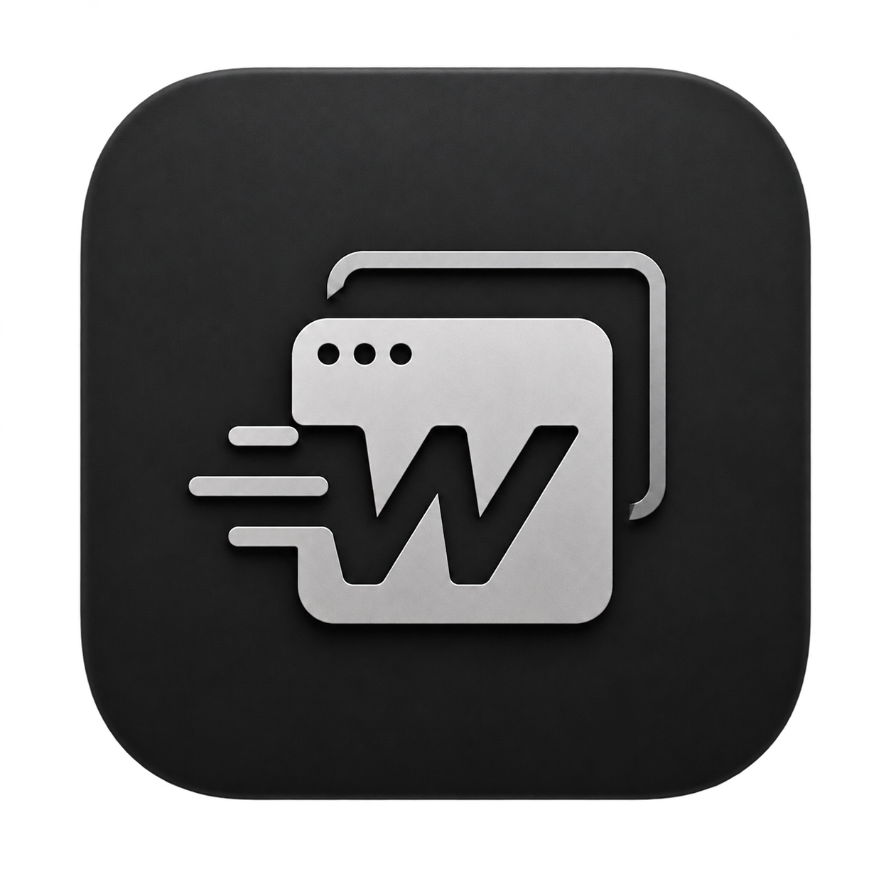

<div align="center">
  
  <h1>WarpTab</h1>
  <p><strong>A fast, native window switcher for macOS.</strong></p>
  <p>Switch between individual windows—not just applications.</p>
</div>

## Why WarpTab?

macOS shows one entry per application in its built-in <kbd>⌘</kbd> <kbd>Tab</kbd> switcher. If Safari, Finder, or another app has several windows open, reaching the one you want takes extra steps.

WarpTab gives every window its own entry in a compact, native macOS switcher. The default shortcut is <kbd>⌥</kbd> <kbd>Tab</kbd>, and it can be changed from the app.

## Highlights

- **Every window is visible** — multiple windows from the same app appear separately.
- **Two layouts** — choose a compact List or a Windows-style Thumbnail grid.
- **Minimized windows included** — select one to restore and focus it.
- **Custom global shortcut** — record the key and modifier combination you prefer.
- **Keyboard-first interaction** — hold the modifier, press the shortcut key to cycle, and release to switch.
- **Click-only pointer selection** — click a window to select it; merely hovering never changes the selection.
- **Native macOS utility** — AppKit interface, menu-bar access, launch at login, and a compact settings window.
- **Local and lightweight** — no accounts, analytics, or network services.

## How it works

With the default shortcut:

1. Hold <kbd>⌥ Option</kbd> and press <kbd>Tab</kbd>. WarpTab appears immediately with the next window selected.
2. Keep holding <kbd>⌥ Option</kbd> and press <kbd>Tab</kbd> again to move through the list.
3. Release <kbd>Tab</kbd> once, then press and hold it to cycle continuously.
4. Release <kbd>⌥ Option</kbd> to open the selected window.

A quick <kbd>⌥</kbd> <kbd>Tab</kbd> press switches directly to the next window. You can also click any visible List row or Thumbnail card to select it before releasing the modifier.

## Requirements

- macOS 13 Ventura or later
- Accessibility permission for discovering and focusing windows
- Screen Recording permission only when using Thumbnail view
- Swift 6 / Xcode Command Line Tools when building from source

## Install with Homebrew

WarpTab is available from this repository as a Homebrew Cask for Apple Silicon Macs:

```sh
brew tap adityav0hra/warptab https://github.com/adityav0hra/WarpTab.git
brew install --cask adityav0hra/warptab/warptab
open /Applications/WarpTab.app
```

Upgrade to the latest published version with:

```sh
brew upgrade --cask adityav0hra/warptab/warptab
```

The first launch is required to grant Accessibility permission and configure automatic background startup.

## Build from source

Clone the repository and run the included app-bundle script:

```sh
git clone https://github.com/adityav0hra/WarpTab.git
cd WarpTab
./scripts/build-app.sh
open dist/WarpTab.app
```

The script creates an ad-hoc signed app at `dist/WarpTab.app`. To keep it in Applications:

```sh
ditto dist/WarpTab.app /Applications/WarpTab.app
open /Applications/WarpTab.app
```

Because local builds are not notarized, macOS may ask you to confirm the first launch.

## Permissions

On first launch, grant WarpTab access in:

**System Settings → Privacy & Security → Accessibility**

WarpTab detects the permission automatically and displays **Active** when window switching is ready. Thumbnail view may additionally prompt for Screen Recording access so it can render window previews.

## Settings

The WarpTab app lets you:

- Enable or disable global window switching
- Record a custom shortcut
- Switch between List and Thumbnail layouts
- Review Accessibility status and open System Settings

Closing the settings window removes WarpTab from the Dock while it continues running from the menu bar. WarpTab also registers itself to launch when you sign in; choosing **Quit WarpTab** stops the current session.

## Project structure

```text
Sources/WarpTab/     AppKit application and window-switching logic
Resources/           App metadata and icon assets
scripts/build-app.sh Release build and app-bundle script
Package.swift        Swift Package Manager configuration
```

## Contributing

Bug reports and focused pull requests are welcome. When changing shortcut or window-focus behavior, please verify first press, repeated cycling, modifier release, minimized windows, and both visual layouts.
