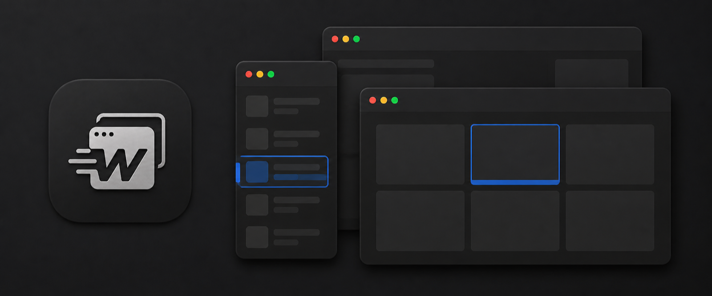
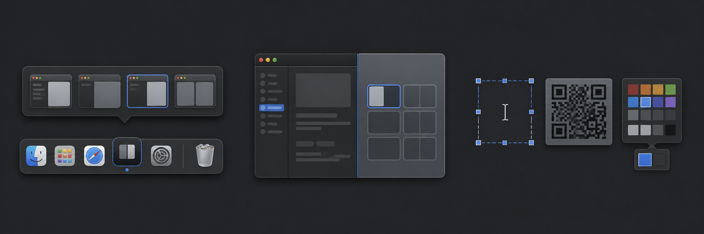

<div align="center">
  
  <h1>WarpTab</h1>
  <p><strong>Move through your Mac at the speed of thought.</strong></p>
  <p>A fast, native macOS utility for switching, previewing, arranging, and managing individual windows.</p>

  <p>
    <a href="https://github.com/adityav0hra/WarpTab/releases/latest"></a>
    
    
    <a href="LICENSE"></a>
  </p>

  <p>
    <a href="https://github.com/adityav0hra/WarpTab/releases/latest"><strong>Download</strong></a>
    ·
    <a href="#install"><strong>Install</strong></a>
    ·
    <a href="#keyboard-guide"><strong>Shortcuts</strong></a>
    ·
    <a href="#privacy-and-permissions"><strong>Privacy</strong></a>
  </p>
</div>



## One app. Every window.

The macOS app switcher shows one icon per application. WarpTab goes a level deeper: every Safari window, Finder window, document, minimized window, and full-screen window can have its own place in the switcher.

Press <kbd>⌥ Option</kbd> <kbd>Tab</kbd>, choose the window you want, and release <kbd>⌥ Option</kbd>. A quick press jumps directly to the next window; holding <kbd>Tab</kbd> cycles continuously.

> **Quiet by default.** Optional features start disabled on a clean installation. Enable only the tools you want from WarpTab Settings.

## More than a window switcher



| Dock previews | Window snapping | Screen Tools |
| :--- | :--- | :--- |
| Preview every window above its Dock icon, then focus or close the exact one you choose. | Move, resize, maximize, restore, minimize, and arrange windows with shortcuts and Snap Assist. | Capture text, recognize QR codes, or copy a colour from any selected region of the screen. |

## Feature set

<table>
  <tr>
    <td width="50%" valign="top">
      <h3>Window switching</h3>
      <ul>
        <li>Individual entries for every application window</li>
        <li>Compact List and visual Thumbnail layouts</li>
        <li>Natural most-recently-used window ordering</li>
        <li>Minimized, hidden, full-screen, and cross-Space windows</li>
        <li>Search by application or window title</li>
        <li>Same-app switching with <kbd>⌥</kbd> <kbd>`</kbd></li>
        <li>Configurable global shortcut and animation controls</li>
      </ul>
    </td>
    <td width="50%" valign="top">
      <h3>Dock intelligence</h3>
      <ul>
        <li>Live previews for applications with one or many windows</li>
        <li>Default and Small preview sizes</li>
        <li>Click a preview to focus only that window</li>
        <li>Close windows directly from their preview</li>
        <li>Optional windowless, minimized, hidden, and full-screen items</li>
        <li>Configurable click and double-click behavior</li>
        <li>Number-key shortcuts for Dock applications</li>
      </ul>
    </td>
  </tr>
  <tr>
    <td width="50%" valign="top">
      <h3>Window control</h3>
      <ul>
        <li>Directional move and snap commands</li>
        <li>Snap Assist for filling the remaining screen area</li>
        <li>Cross-display window movement</li>
        <li>Maximize, restore, minimize, and focus-behind behavior</li>
        <li>Configurable handling for native macOS window tabs</li>
        <li>Optional Windows-style window controls and keyboard behavior</li>
      </ul>
    </td>
    <td width="50%" valign="top">
      <h3>Everyday utilities</h3>
      <ul>
        <li>Per-application Sound Mixer and output controls</li>
        <li>Clipboard history and Finder shortcuts</li>
        <li>Text recognition, QR detection, and colour picking</li>
        <li>Extra mouse-button and side-wheel customization</li>
        <li>Stay Awake controls for display and system sleep</li>
        <li>Menu-bar visibility options for WarpTab tools</li>
      </ul>
    </td>
  </tr>
</table>

## How window switching feels

1. Hold <kbd>⌥ Option</kbd> and press <kbd>Tab</kbd>. WarpTab appears immediately with the next window selected.
2. Keep holding <kbd>⌥ Option</kbd> and tap—or hold—<kbd>Tab</kbd> to move through the windows.
3. Release <kbd>⌥ Option</kbd> to focus the selected window.

You can also type to search, use the arrow keys, or click a visible row or thumbnail. Moving the pointer alone never changes the selection.

For windows belonging only to the current application, use <kbd>⌥ Option</kbd> <kbd>`</kbd>. Add <kbd>Shift</kbd> to move backward.

## Keyboard guide

| Action | Default input |
| :--- | :---: |
| Switch to the next window | <kbd>⌥</kbd> <kbd>Tab</kbd> |
| Switch within the current application | <kbd>⌥</kbd> <kbd>`</kbd> |
| Move backward | Add <kbd>⇧ Shift</kbd> |
| Search visible windows | Start typing |
| Confirm the selected window | <kbd>Return</kbd> |
| Cancel the switcher | <kbd>Esc</kbd> |
| Close the selected window | <kbd>⌘</kbd> <kbd>W</kbd> |
| Minimize the selected window | <kbd>⌘</kbd> <kbd>M</kbd> |
| Hide the selected application | <kbd>⌘</kbd> <kbd>H</kbd> |
| Open or reveal a Dock application | <kbd>⌘</kbd> <kbd>1</kbd>–<kbd>0</kbd> |

The main switcher shortcut is fully configurable in WarpTab Settings.

## Install

### Homebrew

```sh
brew install --cask adityav0hra/warptab/warptab
open /Applications/WarpTab.app
```

To update later:

```sh
brew upgrade --cask adityav0hra/warptab/warptab
```

### Direct download

1. Download the newest archive from [Releases](https://github.com/adityav0hra/WarpTab/releases/latest).
2. Move **WarpTab.app** into **Applications**.
3. Open WarpTab and enable the features you want.

WarpTab runs as a background menu-bar utility and starts when you sign in. Closing its settings window removes it from the Dock without stopping its active features.

## Privacy and permissions

WarpTab works locally on your Mac. It does not require an account and does not include analytics or an online service.

Permissions are requested only when an enabled feature needs them:

| Permission | Used for |
| :--- | :--- |
| **Accessibility** | Discovering, focusing, moving, resizing, and managing application windows |
| **Screen Recording** | Live window thumbnails, Dock previews, Snap Assist previews, and Screen Tools |
| **System Audio Recording** | Per-application Sound Mixer controls |

You can review permission status at any time from **WarpTab → Permissions**. Window switching itself remains available without live thumbnails when Screen Recording is disabled.

## Designed to stay out of the way

- Native AppKit and SwiftUI interface
- Compact, System Settings-style preferences
- Independent switches for optional features
- Optional reduced or disabled animations
- Menu-bar controls can be shown or hidden
- No hover-to-select behavior in the window switcher
- No account, telemetry, or cloud dependency

## Compatibility

- macOS 13 Ventura or later
- Apple Silicon Mac for the official Homebrew Cask
- Accessibility access for window-management features

## Build from source

<details>
<summary>Show build instructions</summary>

```sh
git clone https://github.com/adityav0hra/WarpTab.git
cd WarpTab
./scripts/build-app.sh
open dist/WarpTab.app
```

The app bundle is created at `dist/WarpTab.app`.

For the portable logic checks:

```sh
./scripts/test-engine.sh
./scripts/test-mouse.sh
./scripts/test-screen-tools.sh
```

</details>

## Help and security

- Report ordinary bugs and feature requests through [GitHub Issues](https://github.com/adityav0hra/WarpTab/issues).
- Report security concerns privately by following the [Security Policy](SECURITY.md).
- Include your WarpTab version, macOS version, and clear reproduction steps when reporting a problem.

## License

WarpTab is source-available under its [proprietary license](LICENSE). Personal and internal business use is permitted. Publishing, redistribution, sublicensing, resale, paid-service distribution, and distribution of modified copies require prior written permission.
